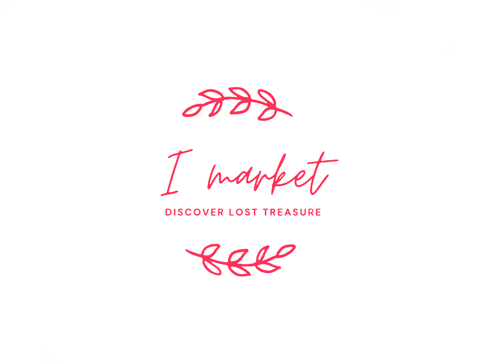

<!-- PROJECT LOGO -->
<br />
<p align="center">
    
  </a>

  <h3 align="center">I Market</h3>

  <p align="center">
    An awesome marketplace to list or buy no longer wanted items!
</p>


<!-- ABOUT THE PROJECT -->
## About The Project

[WireFrame](https://www.figma.com/file/cFh2XL7ibFmmMVbU2zvdoS/Untitled?node-id=0%3A1)

I Market is a marketplace made for my small town of Immokalee located in SouthWest Florida. Our town has a population of about 8000 and this app can be used for people to list or buy items that they no longer need. Our Moto is "Discover Lost Treasure" because you never know what you can find on the app.


### Built With

* [React Native](https://reactnative.dev/)
* [Expo](https://docs.expo.io/)
* [ApiSauce](https://www.npmjs.com/package/apisauce)
* [Procreate](https://procreate.art/)


### Installation

1. Clone the repo
   ```sh
   git clone https://github.com/JoseSustaita/ImarketApp.git
   ```
2. Install NPM packages
   ```sh
   npm install
   ```
3. Run
   ```sh
   npm start
   ```


<!-- CONTRIBUTING -->
## Contributing

Contributions are what make the open source community such an amazing place to be learn, inspire, and create. Any contributions you make are **greatly appreciated**.

1. Fork the Project
2. Create your Feature Branch (`git checkout -b feature/AmazingFeature`)
3. Commit your Changes (`git commit -m 'Add some AmazingFeature'`)
4. Push to the Branch (`git push origin feature/AmazingFeature`)
5. Open a Pull Request


<!-- LICENSE -->
## License

Distributed under the MIT License. See `LICENSE` for more information.


<!-- CONTACT -->
## Contact

Jose Sustaita - [Twitter](https://twitter.com/JoseSustaitaJr) - josesustaita70@gmail.com


